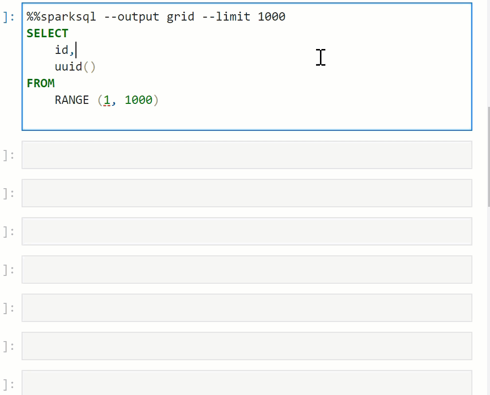
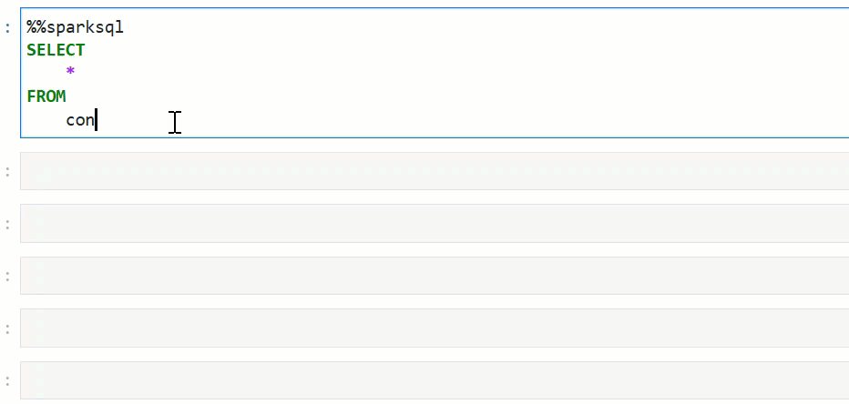

# jupyterlab-sql-editor

A JupyterLab extension providing:

- SQL formatter
- Automatic extraction of database schemas
- Auto-completion triggered by `tab` or `dot`
    - table names
    - table alias
    - table joins
    - nested column names
    - functions
- Syntax highlight
    - line magic
    - cell magic
    - python strings

IPython magic for:
- Spark SQL
- Trino

Many thanks to the contributors of these projects:

- [krassowski/jupyterlab-lsp](https://github.com/jupyter-lsp/jupyterlab-lsp)
- [joe-re/sql-language-server](https://github.com/joe-re/sql-language-server)
- [zeroturnaround/sql-formatter](https://github.com/zeroturnaround/sql-formatter)
- [cryeo/sparksql-magic](https://github.com/cryeo/sparksql-magic)
- [trino-python-client](https://github.com/trinodb/trino-python-client)
- [bloomberg/ipydatagrid](https://github.com/bloomberg/ipydatagrid)


# Overview
- [Installation](#installation)
- [Configuration](#configuration)
- [How it works](#how-it-works)
- [Contributing](#contributing)
- [Setup Trino Server for Testing](#setup-trino-server-for-testing)
- [Security Vulnerability Reporting](#security-vulnerability-reporting)


## Execute and output your query results into an interactive data grid


## Output as JSON


## Auto suggest column names and sub-fields


## Auto suggest JOINs on matching column names


## Format and syntax highlight Notebook code cells


## Format and syntax highlight SQL within python strings


## Capture your Spark query as a Dataframe or a temporary view


# Installation

## Requirements

* JupyterLab >= 3.0

## Install

To install the extension, execute:

```bash
pip install jupyterlab-lsp jupyterlab-sql-editor trino pyspark
```

## Uninstall

To remove the extension, execute:

```bash
pip uninstall jupyterlab-sql-editor
```

# Configure auto completion

Auto completion leverages the sql-language-server project.

### install sql-language-server

```bash
sudo npm install -g sql-language-server
```

```bash
$ npm list -g
/usr/local/lib
├── n@7.0.1
├── npm@7.11.2
├── sql-language-server@1.1.0
├── yarn@1.22.10
└── yo@3.1.1
```

```
ls -lh /usr/local/lib/node_modules/sql-language-server/
```

Remember the location where your module is installed. In this example `/usr/local/lib/`. We will configure jupyterlab-lsp with this location.

# Configuration

## Syntax highlighting

Setting `foreignCodeThreshold` from 50% to 99% prevents the jupyterlab-lsp heuristic which tries to guess the mime type of a code cell. However when a code cell contains both python and SQL code this heuristic interfeer with this extension. We can disable the behaviour by changing the `foreignCodeThreshold` value under the JupyterLab advanced settings.

> Advanced Settings -> Code Syntax -> foreignCodeThreshold

## Configure sql-language-server startup scripts

```bash
$ cat ~/.jupyter/jupyter_server_config.py
```

```python
import shutil
from jupyter_lsp.specs.config import load_config_schema
from jupyter_lsp.types import LanguageServerManagerAPI

mgr = LanguageServerManagerAPI()

# If jupyterlab-lsp has difficulty finding your sql-language-server
# installation, specify additional node_modules paths
mgr.extra_node_roots = ["/usr/local/lib/"]

node_module = key = "sql-language-server"
script = ["dist", "bin", "cli.js"]
args = ["up", "--method", "stdio"]
node_module_path = mgr.find_node_module(node_module, *script)

c.LanguageServerManager.language_servers = {
   "sparksql-language-server": {
        "argv": [mgr.nodejs, node_module_path, *args],
        "languages": ["sparksql"],
        "version": 2,
        "mime_types": ["text/x-sparksql"],
        "display_name": "Spark language server",
        "config_schema": load_config_schema(key),
    },
   "trino-language-server": {
        "argv": [mgr.nodejs, node_module_path, *args],
        "languages": ["trino"],
        "version": 2,
        "mime_types": ["text/x-trino"],
        "display_name": "Trino language server",
        "config_schema": load_config_schema(key),
    }
}
```

Notice that the launch scripts are named `sparksql-language-server` and `trino-language-server`. We will use these names to configure jupyterlab-lsp with each instance of the sql-language-server.


## Configure JupyterLab LSP to use registered sql-language-server

You can configure jupyterlab-lsp using the Advanced Settings Editor or using an `overrides.json` file.

### Using the Advanced Settings Editor


### Using an overrides.json file

First determine the location of the application directory

```bash
$ jupyter lab path
Application directory:   /opt/conda/share/jupyter/lab
User Settings directory: /home/jovyan/.jupyter/lab/user-settings
Workspaces directory: /home/jovyan/.jupyter/lab/workspaces
```


Use application dir to override jupyterlab-lsp configuration

```bash
$ cat /opt/conda/share/jupyter/lab/settings/overrides.json
```

```json
{
    "@krassowski/jupyterlab-lsp:syntax_highlighting": {
        "foreignCodeThreshold": 0.99
    },
    "@krassowski/jupyterlab-lsp:plugin": {
        "logAllCommunication": true,
        "loggingLevel": "debug",
        "setTrace": "verbose",
        "language_servers": {
            "sparksql-language-server": {
                "serverSettings": {
                    "sqlLanguageServer": {
                        "connections": [
                            {
                                "name": "pyspark-conf",
                                "adapter": "json",
                                "filename": "/tmp/sparkdb.schema.json",
                                "jupyterLabMode": true
                            }
                        ]
                    }
                }
            },
            "trino-language-server": {
                "serverSettings": {
                    "sqlLanguageServer": {
                        "connections": [
                            {
                                "name": "trino-conf",
                                "adapter": "json",
                                "filename": "/tmp/trinodb.schema.json",
                                "jupyterLabMode": true
                            }
                        ]
                    }
                }
            }
        }
    }
}
```

Notice the two sections `sparksql-language-server` and `trino-language-server` each with their own schema file location.


## Pre-configure Magics (optional)

SparkSql and Trino magic can be configured inside a Notebook. However it's convinient pre-configured them using an ipython profile.

```bash
$ cat ~/.ipython/profile_default/ipython_config.py 

# get the config
c = get_config()

# pre-load the sparksql magic
c.InteractiveShellApp.extensions = [
    'ipython_magic.trino', 'ipython_magic.sparksql'
]

# pre-configure the SparkSql magic.
c.SparkSql.limit=20
c.SparkSql.cacheTTL=3600
c.SparkSql.outputFile='/tmp/sparkdb.schema.json'
c.SparkSql.catalogs='default'

# pre-configure the Trino magic.
import trino
c.Trino.auth=trino.auth.BasicAuthentication("principal id", "password")
c.Trino.user=None
c.Trino.host='localhost'
c.Trino.port=443
c.Trino.httpScheme='https'
c.Trino.cacheTTL=3600
c.Trino.outputFile='/tmp/trinodb.schema.json'
c.Trino.catalogs="system,tpch"

# pre-configure to display all cell outputs in notebook
from IPython.core.interactiveshell import InteractiveShell
InteractiveShell.ast_node_interactivity = 'all'

```


# How it works


### Code completion

Code completion is performed by an LSP server [sql-language-server](https://github.com/joe-re/sql-language-server) which plugs into the [jupyterlab-lsp](https://github.com/krassowski/jupyterlab-lsp) JupyterLab extension.

### Transclusions

`jupyterlab-sql-editor` includes transclusions to extract SQL statements from
  - sparksql cell magic
  - sparksql line magic
  - sql in a python string (using special --start/end-sql-syntax markers)

Transclusions is what [jupyterlab-lsp](https://github.com/krassowski/jupyterlab-lsp) uses to extract parts of a cell in this case SQL statements and passes them to the `sql-language-server` for evaluation. This enables auto completion of spark SQL keywords, tables, columns and functions.

### Syntax Highlighting
`jupyterlab-sql-editor` registers 3 multiplexed CodeMirrors to support precise syntax highlighting. A multiplexed CodeMirror is registered for
  - sparksql cell magic
  - sparksql line magic
  - sql in python string

Multiplexed CodeMirror are better at detecting what to syntax highligh as python and what to syntax highlight as SQL. It does not rely on `jupyterlab-lsp` heuristic detection which passed a given [foreignCodeThreshold](https://github.com/krassowski/jupyterlab-lsp/blob/master/packages/jupyterlab-lsp/schema/syntax_highlighting.json) will change the mode of the entire cell's editor. Instead multiplexed CodeMirror is able to support SQL mode which is embedded in a python mode and will syntax highligh each section the cell accordingly.


However you'll notice that as your SQL query gets larger the code cell will switch from python syntax hilighting to SQL syntax hilighting.  This is due to the fact that jupyter-lsp has a builtin behaviour to do this. It can be found here.

https://github.com/krassowski/jupyterlab-lsp/blob/a52d4220ab889d0572091410db7f77fa93652f1c/packages/jupyterlab-lsp/src/features/syntax_highlighting.ts#L90

```
		// change the mode if the majority of the code is the foreign code
        if (coverage > this.settings.composite.foreignCodeThreshold) {
          editors_with_current_highlight.add(ce_editor);
          let old_mode = editor.getOption('mode');
          if (old_mode != mode.mime) {
            editor.setOption('mode', mode.mime);
          }
```

This is why we recommend increasing the `foreignCodeThreshold` to 99%.


# Contributing

We :heart: contributions.

Have you had a good experience with this project? Why not share some love and contribute code, or just let us know about any issues you had with it?

We welcome issue reports [here](../../issues); be sure to choose the proper issue template for your issue, so that we can be sure you're providing the necessary information.


### Development install

Note: You will need NodeJS to build the extension package.

The `jlpm` command is JupyterLab's pinned version of
[yarn](https://yarnpkg.com/) that is installed with JupyterLab. You may use
`yarn` or `npm` in lieu of `jlpm` below.


Clone the repo to your local environment

Run the following commands to install the initial project dependencies and install the extension into the JupyterLab environment.

```bash
pip install -ve .
```

The above command copies the frontend part of the extension into JupyterLab. We can run this pip install command again every time we make a change to copy the change into JupyterLab. Even better, we can use the develop command to create a symbolic link from JupyterLab to our source directory. This means our changes are automatically available in JupyterLab:

```bash
jupyter labextension develop . --overwrite
# Rebuild extension Typescript source after making changes
jlpm run build
```

You can watch the source directory and run JupyterLab at the same time in different terminals to watch for changes in the extension's source and automatically rebuild the extension.

```bash
# Watch the source directory in one terminal, automatically rebuilding when needed
jlpm run watch
# Run JupyterLab in another terminal
jupyter lab
```

With the watch command running, every saved change will immediately be built locally and available in your running JupyterLab. Refresh JupyterLab to load the change in your browser (you may need to wait several seconds for the extension to be rebuilt).

By default, the `jlpm run build` command generates the source maps for this extension to make it easier to debug using the browser dev tools. To also generate source maps for the JupyterLab core extensions, you can run the following command:

```bash
jupyter lab build --minimize=False
```


### Development uninstall

```bash
pip uninstall jupyterlab-sql-editor
```

In development mode, you will also need to remove the symlink created by `jupyter labextension develop`
command. To find its location, you can run `jupyter labextension list` to figure out where the `labextensions`
folder is located. Then you can remove the symlink named `jupyterlab-sql-editor` within that folder.

### Packaging the extension

See [RELEASE](RELEASE.md)


### Installing sql-language-server from source

For development you can install the sql-language-server from source.

```bash
cd pacakges/server
npm run prepublish
```

Link the location of node_modules to your build location. By running jupyter lab with debug output you can see where it will search for node_modules. For example here's a log when using the bash magic.

```bash
jupyter lab --log-level=DEBUG > jupyter.log 2>&1

cat jupyter.log
[D 2021-09-08 21:10:53.111 ServerApp] Checking for /home/jovyan/node_modules/bash-language-server/bin/main.js
[D 2021-09-08 21:10:53.111 ServerApp] Checking for /opt/conda/share/jupyter/lab/staging/node_modules/bash-language-server/bin/main.js
[D 2021-09-08 21:10:53.111 ServerApp] Checking for /opt/conda/lib/node_modules/bash-language-server/bin/main.js
[D 2021-09-08 21:10:53.111 ServerApp] Checking for /opt/conda/node_modules/bash-language-server/bin/main.js
```

Once you know where jupyter lab looks for node_modules you can create a link to your built version.

```bash
cd /home/jovyan/node_modules/
ln -s ~/dev/sql-language-server/packages/server/ sql-language-server
```


# Setup Trino Server for Testing

Download server
```bash 
wget https://repo1.maven.org/maven2/io/trino/trino-server/364/trino-server-364.tar.gz
tar -zxvf trino-server-364.tar.gz
cd trino-server-364
mkdir etc
 ```

Create a file etc/node.properties 
```properties
node.environment=production
node.id=ffffffff-ffff-ffff-ffff-ffffffffffff
node.data-dir=/var/trino/data
```

Create a file etc/jvm.config 
```properties
-server
-Xmx16G
-XX:-UseBiasedLocking
-XX:+UseG1GC
-XX:G1HeapRegionSize=32M
-XX:+ExplicitGCInvokesConcurrent
-XX:+ExitOnOutOfMemoryError
-XX:+HeapDumpOnOutOfMemoryError
-XX:-OmitStackTraceInFastThrow
-XX:ReservedCodeCacheSize=512M
-XX:PerMethodRecompilationCutoff=10000
-XX:PerBytecodeRecompilationCutoff=10000
-Djdk.attach.allowAttachSelf=true
-Djdk.nio.maxCachedBufferSize=2000000
```

Create a file etc/config.properties 
```properties
coordinator=true
node-scheduler.include-coordinator=true
http-server.http.port=8080
query.max-memory=5GB
query.max-memory-per-node=1GB
query.max-total-memory-per-node=2GB
discovery.uri=http://localhost:8080
```

Configure the sample TPCH database
```bash
mkdir etc/catalog
```

Create a file etc/catalog/tpch.properties with this content
```properties
connector.name=tpch
```


Launch the Trino server
```bash
bin/launcher start
```


## Security Vulnerability Reporting

If you believe you have identified a security vulnerability in this project, please send email to the project
team at opensource@cybercenter.gc.ca, detailing the suspected issue and any methods you've found to reproduce it.

Please do NOT open an issue in the GitHub repository, as we'd prefer to keep vulnerability reports private until
we've had an opportunity to review and address them.
