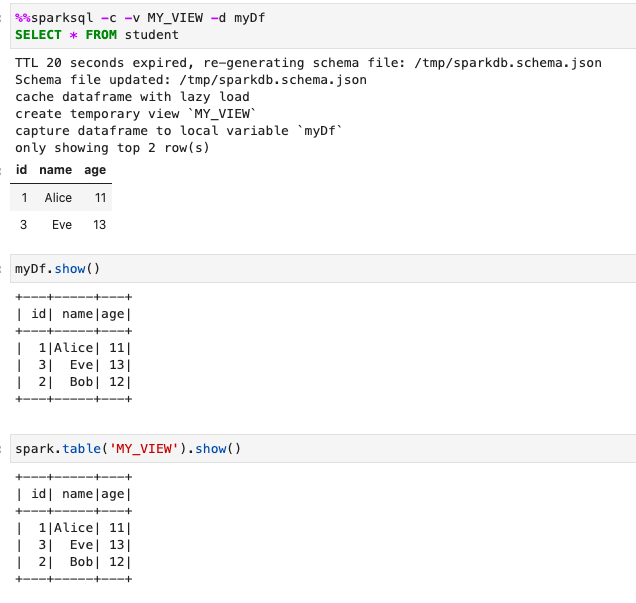
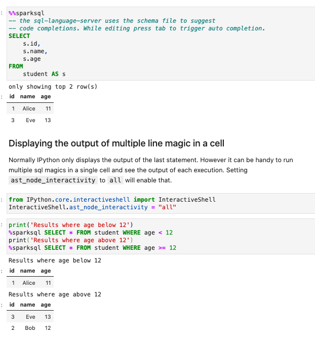

# jupyterlab-sql-editor

SQL support for JupyterLab:

- IPython Spark line and cell magic to execute Spark SQL queries
- IPython Trino line and cell magic to execute Trino queries
- SQL formatter
- Automatic extraction of database schemas (tables, columns, functions) including any locally created tables
- Completion of tables, columns, functions (triggered by `tab` or `dot`)
- Syntax highlighting of line magic, cell magic and within python strings

jupyterlab-sql-editor leverages the following projects:

- [krassowski/jupyterlab-lsp](https://github.com/jupyter-lsp/jupyterlab-lsp)
- [joe-re/sql-language-server](https://github.com/joe-re/sql-language-server)
- [zeroturnaround/sql-formatter](https://github.com/zeroturnaround/sql-formatter)
- [cryeo/sparksql-magic](https://github.com/cryeo/sparksql-magic)
- [trino-python-client](https://github.com/trinodb/trino-python-client)


You can capture the query as a Dataframe and make use of it in later cells.

You can also create a temporary view out of the query and make use of this view in other Spark SQL queries.



The IPython kernel is usually configured to output one result. However you can change this so that every line magic outputs its results.



You can output your results to [qgrid](https://github.com/quantopian/qgrid) which lets you manipulate the results in an interactive widget.


You can use the ipython_config.py file to setup your prefered magic settings.


Code completion is triggered on dot characters and when the tab key is pressed. You can complete nested fields, table names, functions and joins.


Code formatting is accomplished by the [sql-formatter](https://github.com/zeroturnaround/sql-formatter).


You can also format SQL within a python string.


`jupyterlab-sql-editor` is based on the [sparksql-magic](https://github.com/cryeo/sparksql-magic) project and expands on it by adding
  - support for line magic
  - automatic generation of [sql-language-server](https://github.com/joe-re/sql-language-server) schema file for auto completion support
  - support fromating sql using the sql-formatter project [sql-formatter](https://github.com/zeroturnaround/sql-formatter)

### Transclusions

`jupyterlab-sql-editor` includes transclusions to extract SQL statements from
  - sparksql cell magic
  - sparksql line magic
  - sql in a python string (using special --start/end-sql-syntax markers)

Transclusions is what [jupyterlab-lsp](https://github.com/krassowski/jupyterlab-lsp) uses to extract parts of a cell in this case SQL statements and passes them to the `sql-language-server` for evaluation. This enables auto completion of spark SQL keywords, tables, columns and functions.

### Syntax Highlighting
`jupyterlab-sql-editor` registers 3 multiplexed CodeMirrors to support precise syntax highlighting. A multiplexed CodeMirror is registered for
  - sparksql cell magic
  - sparksql line magic
  - sql in python string

Multiplexed CodeMirror are better at detecting what to syntax highligh as python and what to syntax highlight as SQL. It does not rely on `jupyterlab-lsp` heuristic detection which passed a given [foreignCodeThreshold](https://github.com/krassowski/jupyterlab-lsp/blob/master/packages/jupyterlab-lsp/schema/syntax_highlighting.json) will change the mode of the entire cell's editor. Instead multiplexed CodeMirror is able to support SQL mode which is embedded in a python mode and will syntax highligh each section the cell accordingly.


We can thus increase the `foreignCodeThreshold` from 50% to 99% to prevent this behaviour. The configuration is under the JupyterLab advanced settings.

> Advanced Settings -> Code Syntax -> foreignCodeThreshold


However you'll notice that as your SQL query gets larger the code cell will switch from python syntax hilighting to SQL syntax hilighting.  This is due to the fact that jupyter-lsp has a builtin behaviour to do this. It can be found here.

https://github.com/krassowski/jupyterlab-lsp/blob/a52d4220ab889d0572091410db7f77fa93652f1c/packages/jupyterlab-lsp/src/features/syntax_highlighting.ts#L90

```
		// change the mode if the majority of the code is the foreign code
        if (coverage > this.settings.composite.foreignCodeThreshold) {
          editors_with_current_highlight.add(ce_editor);
          let old_mode = editor.getOption('mode');
          if (old_mode != mode.mime) {
            editor.setOption('mode', mode.mime);
          }
```


## Requirements

* JupyterLab >= 3.0

## Install

To install the extension, execute:

```bash
npm install --save-dev sql-language-server
```

## Uninstall

To remove the extension, execute:

```bash
pip uninstall jupyterlab-sql-editor
```


## Contributing

### Development install

Note: You will need NodeJS to build the extension package.

The `jlpm` command is JupyterLab's pinned version of
[yarn](https://yarnpkg.com/) that is installed with JupyterLab. You may use
`yarn` or `npm` in lieu of `jlpm` below.


Clone the repo to your local environment

Run the following commands to install the initial project dependencies and install the extension into the JupyterLab environment.

```bash
pip install -ve .
```

The above command copies the frontend part of the extension into JupyterLab. We can run this pip install command again every time we make a change to copy the change into JupyterLab. Even better, we can use the develop command to create a symbolic link from JupyterLab to our source directory. This means our changes are automatically available in JupyterLab:

```bash
jupyter labextension develop . --overwrite
# Rebuild extension Typescript source after making changes
jlpm run build
```

You can watch the source directory and run JupyterLab at the same time in different terminals to watch for changes in the extension's source and automatically rebuild the extension.

```bash
# Watch the source directory in one terminal, automatically rebuilding when needed
jlpm run watch
# Run JupyterLab in another terminal
jupyter lab
```

With the watch command running, every saved change will immediately be built locally and available in your running JupyterLab. Refresh JupyterLab to load the change in your browser (you may need to wait several seconds for the extension to be rebuilt).

By default, the `jlpm run build` command generates the source maps for this extension to make it easier to debug using the browser dev tools. To also generate source maps for the JupyterLab core extensions, you can run the following command:

```bash
jupyter lab build --minimize=False
```

JupyterLab extensions for JupyterLab 3.0 can be distributed as Python packages. The cookiecutter template we used contains all of the Python packaging instructions in the pyproject.toml file to wrap your extension in a Python package. Before generating a package, we first need to install build.

To create a Python wheel package (.whl) in the dist/ directory, do:

```bash
python -m build
```

The command will build the JavaScript into a bundle in the jupyterlab_apod/labextension/static directory, which is then distributed with the Python package. This bundle will include any necessary JavaScript dependencies as well. You may want to check in the jupyterlab_apod/labextension/static directory to retain a record of what JavaScript is distributed in your package, or you may want to keep this “build artifact” out of your source repository history.

You can now try installing your extension as a user would. Open a new terminal and run the following commands to create a new environment and install your extension.

```bash
conda create -n jupyterlab-apod jupyterlab
conda activate jupyterlab-apod
pip install jupyterlab_apod/dist/jupyterlab_apod-0.1.0-py3-none-any.whl
jupyter lab
```

### Development uninstall

```bash
pip uninstall jupyterlab-sql-editor
```

In development mode, you will also need to remove the symlink created by `jupyter labextension develop`
command. To find its location, you can run `jupyter labextension list` to figure out where the `labextensions`
folder is located. Then you can remove the symlink named `jupyterlab-sql-editor` within that folder.

### Packaging the extension

See [RELEASE](RELEASE.md)


## SparkSql Magic

### Load
```
%load_ext sparksql
```

### Config
```
%config SparkSql.limit=<INT>
%config SparkSql.cacheTTL=<INT>
%config SparkSql.outputFile=<STRING>
```

|Option|Default|Description|
|---|---|---|
|`SparkSql.limit`|20|The maximum number of rows to display|
|`SparkSql.cacheTTL`|3600|Re-generate output schema file if older than time specified|

### Parameter
```
# Cell magic
%%sparksql [-c|--cache] [-e|--eager] [-v|--view VIEW] [-l|--limit LIMIT] [-d|--dataframe DATAFRAME] [-f|--outputFile filename] [-t|--cacheTTL seconds]
<SQL QUERY>

# Line magic
%sparksql [-c|--cache] [-e|--eager] [-v|--view VIEW] [-l|--limit LIMIT]  [-d|--dataframe DATAFRAME] [-f|--outputFile filename] [-t|--cacheTTL seconds]
<SQL QUERY>

```

|Parameter|Description|
|---|---|
|`-d DATAFRAME` `--dataframe DATAFRAME`|Capture dataframe in a local variable|
|`-c` `--cache`|Cache dataframe|
|`-e` `--eager`|Cache dataframe with eager load|
|`-v VIEW` `--view VIEW`|Create or replace temporary view|
|`-l LIMIT` `--limit LIMIT`|The maximum number of rows to display (Default: `SparkSql.limit`)|
|`-f fileName` `--outputFile fileName`|Output schema to specified file, defaults to /tmp/sparkdb.schema.json|
|`-t seconds` `--cacheTTL seconds`|Re-generate output schema file if older than time specified (defaults to 3600 seconds)|
|`sql`|SQL statement|
| `-a CATALOGS` `--catalogs CATALOGS` |  Retrive schema from the specified list of catalogs |
|`-q` `--qgrid` | Display results in qgrid |


# Configure auto completion

Auto completion leverages the sql-language-server project.

### install sql-language-server

```bash
pip install sql-language-server
```

### Install sql-language-server from source

For development you can install the sql-language-server from source.

```bash
cd pacakges/server
npm run prepublish
```

Link the location of node_modules to your build location. By running jupyter lab with debug output you can see where it will search for node_modules. For example here's a log when using the bash magic.

```bash
jupyter lab --log-level=DEBUG > jupyter.log 2>&1

cat jupyter.log
[D 2021-09-08 21:10:53.111 ServerApp] Checking for /home/jovyan/node_modules/bash-language-server/bin/main.js
[D 2021-09-08 21:10:53.111 ServerApp] Checking for /opt/conda/share/jupyter/lab/staging/node_modules/bash-language-server/bin/main.js
[D 2021-09-08 21:10:53.111 ServerApp] Checking for /opt/conda/lib/node_modules/bash-language-server/bin/main.js
[D 2021-09-08 21:10:53.111 ServerApp] Checking for /opt/conda/node_modules/bash-language-server/bin/main.js
```

Once you know where jupyter lab looks for node_modules you can create a link to your built version.

```bash
cd /home/jovyan/node_modules/
ln -s ~/dev/sql-language-server/packages/server/ sql-language-server
```

## Configure sql-language-server startup scripts

```python

$ cat /home/jovyan/.jupyter/jupyter_server_config.py

# # jupyter_server_config.py
import shutil


from jupyter_lsp.specs.config import load_config_schema
from jupyter_lsp.types import LanguageServerManagerAPI

mgr = LanguageServerManagerAPI()

node_module = key = "sql-language-server"
script = ["dist", "bin", "cli.js"]
args = ["up", "--debug", "--method", "stdio"]
node_module_path = mgr.find_node_module(node_module, *script)

# You can specify additional node_modules path if jupyterlab-lsp has
# difficulty finding your installation of sql-language-server
mgr.extra_node_roots = ["~/.nvm/versions/node/v14.17.6/lib"]


# c is a magic, lazy variable
c.LanguageServerManager.language_servers = {
   "sparksql-language-server": {
        "argv": [mgr.nodejs, node_module_path, *args],
        "languages": ["sparksql"],
        "version": 2,
        "mime_types": ["text/x-sparksql"],
        "display_name": "Spark language server",
        "config_schema": load_config_schema(key),
    },
   "trino-language-server": {
        "argv": [mgr.nodejs, node_module_path, *args],
        "languages": ["trino"],
        "version": 2,
        "mime_types": ["text/x-trino"],
        "display_name": "Trino language server",
        "config_schema": load_config_schema(key),
    }
}
```

Notice that the launch scripts are named `sparksql-language-server` and `trino-language-server`. We will use these names to configure each instance separately in the overrides.json file.

## Configure JupyterLab LSP to use sql-language-server

```bash
$ jupyter lab path
Application directory:   /opt/conda/share/jupyter/lab
User Settings directory: /home/jovyan/.jupyter/lab/user-settings
Workspaces directory: /home/jovyan/.jupyter/lab/workspaces
```

Use application dir to override configuration

```bash
$ cat /opt/conda/share/jupyter/lab/settings/overrides.json
```

```json
{
    "@krassowski/jupyterlab-lsp:syntax_highlighting": {
        "foreignCodeThreshold": 0.99
    },
    "@krassowski/jupyterlab-lsp:plugin": {
        "logAllCommunication": true,
        "loggingLevel": "debug",
        "setTrace": "verbose",
        "language_servers": {
            "sparksql-language-server": {
                "serverSettings": {
                    "sqlLanguageServer": {
                        "connections": [
                            {
                                "name": "pyspark-conf",
                                "adapter": "json",
                                "filename": "/tmp/sparkdb.schema.json",
                                "jupyterLabMode": true
                            }
                        ]
                    }
                }
            },
            "trino-language-server": {
                "serverSettings": {
                    "sqlLanguageServer": {
                        "connections": [
                            {
                                "name": "trino-conf",
                                "adapter": "json",
                                "filename": "/tmp/trinodb.schema.json",
                                "jupyterLabMode": true
                            }
                        ]
                    }
                }
            }
        }
    }
}
```

Notice the two sections `sparksql-language-server` and `trino-language-server` each with their own schema file.


## Predefined Magic Configurations

SparkSql and TrinoSql magic can be pre-configured using the ipython profile_default. For example you can set the location of the schema file output location. To do this edit the ipython_config.py file.


```bash
$ cat /home/jovyan/.ipython/profile_default/ipython_config.py 

# get the config
c = get_config()

# pre-load the sparksql magic
c.InteractiveShellApp.extensions = [
    'ipython_sparksql_magic', 'ipython_trino_magic'
]

# pre-configure the SparkSql magic.
c.SparkSql.limit=20
c.SparkSql.cacheTTL=3600
c.SparkSql.outputFile='/tmp/sparkdb.schema.json'
c.SparkSql.catalogs='default'

# pre-configure the Trino magic.
import trino
c.Trino.auth=trino.auth.BasicAuthentication("principal id", "password")
c.Trino.user=None
c.Trino.host='localhost'
c.Trino.port=443
c.Trino.httpScheme='https'
c.Trino.cacheTTL=3600
c.Trino.outputFile='/tmp/trinodb.schema.json'
c.Trino.catalogs="system,tpch"

# pre-configure to display all cell outputs in notebook
from IPython.core.interactiveshell import InteractiveShell
InteractiveShell.ast_node_interactivity = 'all'

```