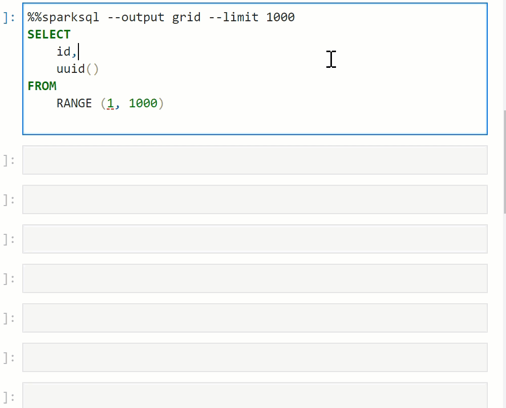
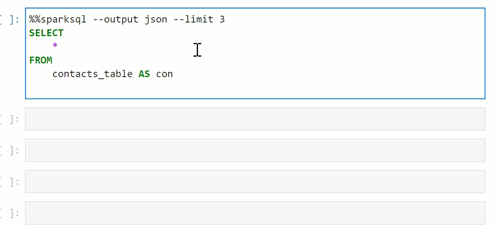
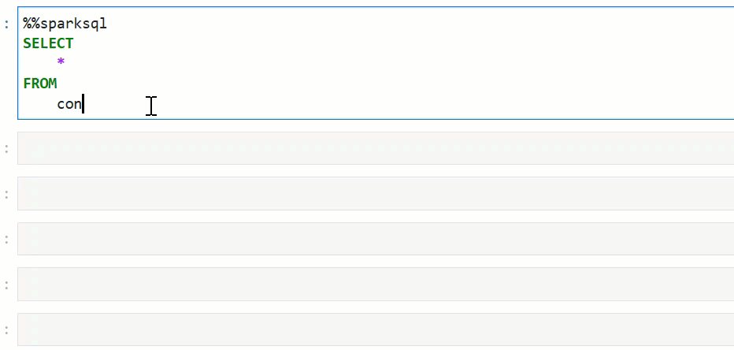
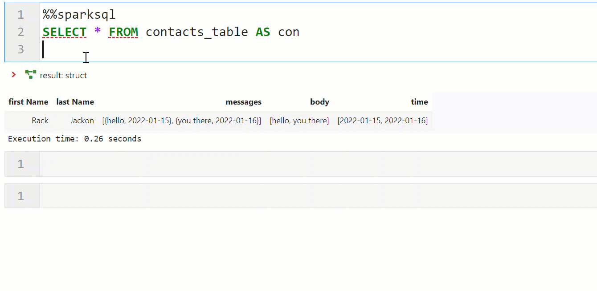
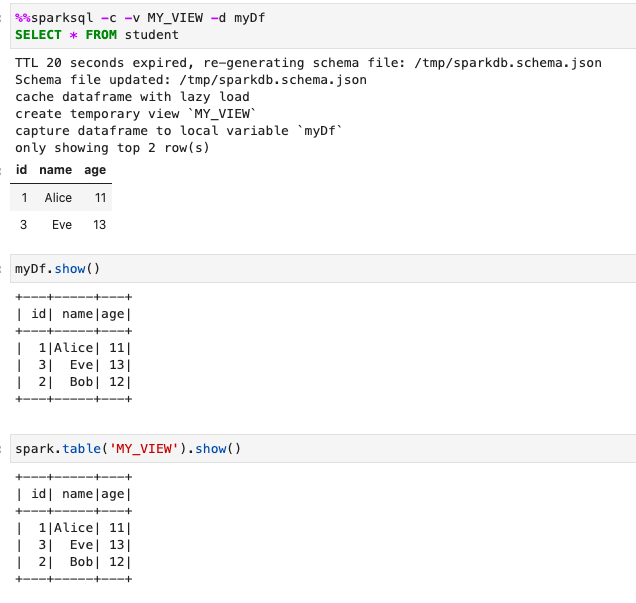
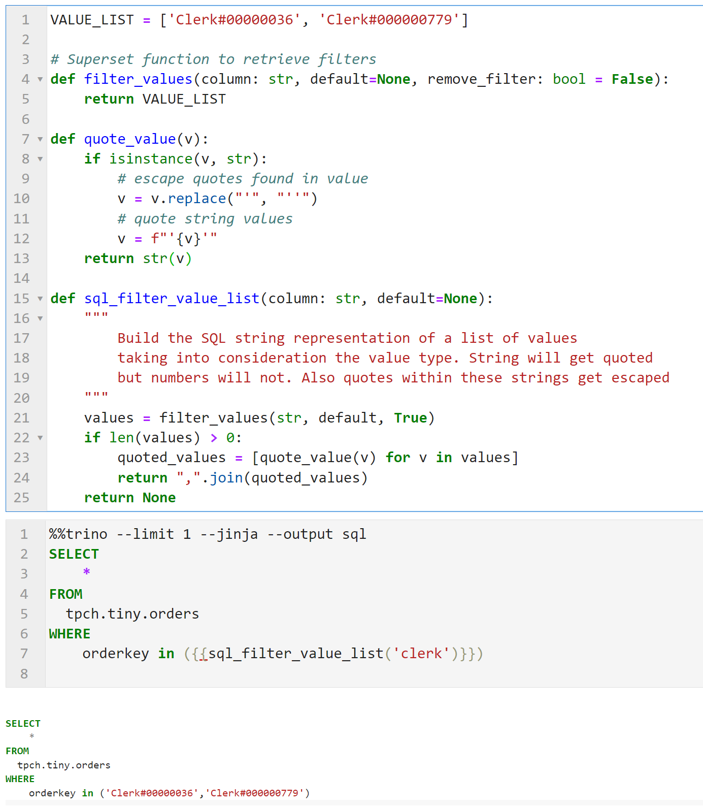

# sparksql magic

A JupyterLab extension providing the following features via `%%sparksql` and `%%trino` magics:

- SQL formatter
- Automatic extraction of database schemas
- Auto-completion triggered by `tab` or `dot` for:
  - table names
  - table aliases
  - table joins
  - nested column names
  - functions
- Syntax highlighting for:
  - line magic
  - cell magic
  - Python strings

## Execute and output your query results into an interactive data grid



## Output as JSON



## Auto suggest column names and sub-fields



## Auto suggest JOINs on matching column names



## Format and show syntax highlighting in Notebook code cells

To format SQL statements in the cell, right-click in the cell and select `Format Sql Cell` or hit `<CTRL+Q>`.


## Works in Python strings

While inside a notebook, you can have a multi-line Python string containing SQL and enjoy the same features (syntax highlighting, code completion and SQL formatting)
as in a `sparksql` cell by wrapping your string with `--start-sparksql` and `--end-sparksql`. Here is an example:

```python
# declare a python string
sql = """
--start-sparksql
SELECT
    *
FROM
    table AS t
--end-sparksql
"""
print(sql)
```


## Capture your Spark query as a Dataframe or a temporary view



## Use jinja templating to create re-usable SQL



## Usage

Parameter usage example:

```
%%sparksql -c -l 10 --dataframe df
<QUERY>
```

| Parameter                                                                                                                        | Description                                                                                                                                   |
| -------------------------------------------------------------------------------------------------------------------------------- | --------------------------------------------------------------------------------------------------------------------------------------------- |
| `--database NAME`                                                                                                                | Spark database to use.                                                                                                                        |
| `-l LIMIT`, `--limit LIMIT`                                                                                                      | The maximum number of rows to display. A value of zero is equivalent to `--output skip`                                                       |
| `-r all\|local\|none`, `--refresh all\|local\|none`                                                                              | Force the regeneration of the schema cache file. The `local` option will only update tables/views created in the local Spark context.         |
| `-d NAME`, `--dataframe NAME`                                                                                                    | Capture results in a Spark dataframe named `NAME`.                                                                                            |
| `-c`, `--cache`                                                                                                                  | Cache dataframe.                                                                                                                              |
| `-e`, `--eager`                                                                                                                  | Cache dataframe with eager load.                                                                                                              |
| `-v VIEW`, `--view VIEW`                                                                                                         | Create or replace a temporary view named `VIEW`.                                                                                              |
| `-i NAME`, `--input NAME`                                                                                                        | Display pandas or Spark dataframe named `NAME`.                                                                                               |
| `-o sql\|json\|html\|aggrid\|grid\|text\|schema\|skip\|none`, `--output sql\|json\|html\|aggrid\|grid\|text\|schema\|skip\|none` | Output format. Defaults to html. The `sql` option prints the SQL statement that will be executed (useful to test jinja templated statements). |
| `-s`, `--show-nonprinting`                                                                                                       | Replace none printable characters with their ascii codes (`LF` -> `\x0a`)                                                                     |
| `-j`, `--jinja`                                                                                                                  | Enable Jinja templating support.                                                                                                              |
| `-b`, `--dbt`                                                                                                                    | Enable DBT templating support.                                                                                                                |
| `-t LIMIT`, `--truncate LIMIT`                                                                                                   | Truncate output.                                                                                                                              |
| `-m update\|complete`, `--streaming_mode update\|complete`                                                                       | The mode of streaming queries.                                                                                                                |
| `-x`, `--lean-exceptions`                                                                                                        | Shortened exceptions. Might be helpful if the exceptions reported by Spark are noisy such as with big SQL queries.                            |
